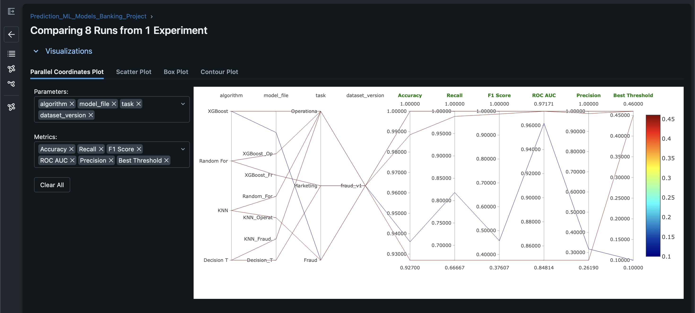

## 🏦 Bank financial enterprise engineer project

## 🎯 Goals project
- Credit Risk analysis -> High consumer impact
    - Modeling toward to target data variable
    - Credit scoring for preventing customer churn
    - Audit credit risk score analyst to improve credit database
- Fraud Detection -> High financial fraud prevention
    - Transaction monitoring
    - Real-time detection with Fraud label
    - Data scalability on monitoring insights
- Market Risk -> Systematic implication
    - Volatility forecasting to improve Bank advantage in each sides
    - Optioning on pricing product to get stabilize market
- Operation Risk -> Internal focus to improve company system
    - Predictive maintenance if exists in Production
    - Root causes analysis

## 🤖 Conftusion matrix on metrics machine learning models result -> (Fraud detection, Market Risk, Operational Risk)
- Decision Tree Classifier - Confusion Matrix
    
- KNeighbor Classifier - Confusion Matrix
    
- Random Forest Classifier - Confusion Matrix
    
- XGBoost Classifier - Confusion Matrix
    

## 🏦 API Production -> Models ingested to embed in Production with API Integration
- Machine learning models Information -> Churn and Fraud (Involving Market analysis, Operational risk, Fraud detection, Credit risk analysis)
    - Machine learning models information
    
    - Customer churn prediction with probability
    
    - Fraud detection with models choice by users or best model chosen
    
    - Marketing prediction with reasoning engine -> Reasoning: based on data features inputed the Decision Tree model represents prediction true label about 2 values.
    Probability = 1.0 represent perfect of proba this means in marketing prediction has strong premis to give a reasoning.
    
    - Operational risk prediction with reasoning engine -> Reasoning: based on data features inputed the Decision Tree model represents prediction true label out 0 values.
    Probability = 1.0 represent about the operational will getting elevated risk.
    
- Gradio -> User Interface (UI) for website implementation on Fintech real-time project condition
    - User Interface (UI) for Marketing prediction
    
    - User Interface (UI) for Operational Risk prediction
    

- MLFlow -> Tracking machine learning models & improve metrics result on based models
    - Machine learning models metrics -> visualization on coordinates parallel plot
    
    - Machine learning models metrics comparison
    
    - Metrics result comparison with scores
    
    
    - Registered models
    
    - List models on API
    

- LLM -> Large Language Models for Banking solution for simplify complex problem
    - Banking LLM AI insights
    

- Grafana & Prometheus

## 🧠 Metrics output on Machine Learning models -> Churn prediction
Training model Decision Tree...
Classification report for Decision Tree:
              precision    recall  f1-score   support

           0       1.00      1.00      1.00      1592
           1       1.00      0.99      0.99       408

    accuracy                           1.00      2000
   macro avg       1.00      0.99      1.00      2000
weighted avg       1.00      1.00      1.00      2000

Precision: 1.0000
Recall: 0.9853
F1 Score: 0.9926
Accuracy: 0.9970
Training model Random Forest...
Classification report for Random Forest:
              precision    recall  f1-score   support

           0       1.00      1.00      1.00      1592
           1       1.00      1.00      1.00       408

    accuracy                           1.00      2000
   macro avg       1.00      1.00      1.00      2000
weighted avg       1.00      1.00      1.00      2000

Precision: 0.9975
Recall: 0.9951
F1 Score: 0.9963
Accuracy: 0.9985
Training model Logistic Regression...
Classification report for Logistic Regression:
              precision    recall  f1-score   support

           0       1.00      1.00      1.00      1592
           1       1.00      1.00      1.00       408

    accuracy                           1.00      2000
   macro avg       1.00      1.00      1.00      2000
weighted avg       1.00      1.00      1.00      2000

Precision: 0.9975
Recall: 0.9951
F1 Score: 0.9963
Accuracy: 0.9985
Training model XGBoost...
Classification report for XGBoost:
              precision    recall  f1-score   support

           0       1.00      1.00      1.00      1592
           1       1.00      0.99      1.00       408

    accuracy                           1.00      2000
   macro avg       1.00      1.00      1.00      2000
weighted avg       1.00      1.00      1.00      2000

Precision: 0.9975
Recall: 0.9926
F1 Score: 0.9951
Accuracy: 0.9980